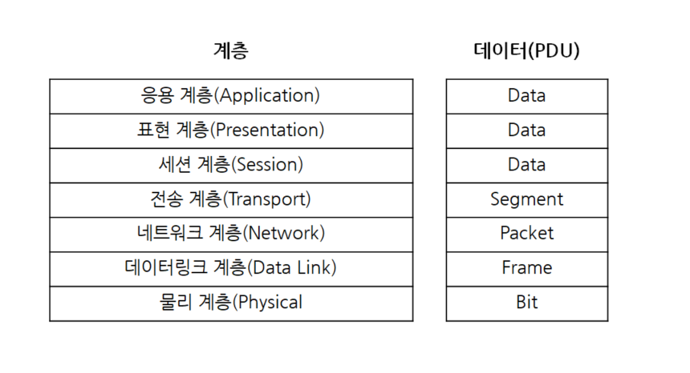

# OSI 7계층 
- 국제표준화기구(ISO)에서 개발한 모델로, 네트워크 통신을 단계별로 계층을 나누어 설명한 것이다. 각 계층은 독립적인 역할을 부여 받아 동작한다.
- 하위 계층으로 내려갈수록 Encapsulation(캡슐화)이 진행되고, 상위 계층으로 올라갈수록 Decapsultation(디캡슐화)이 진행된다.
- 데이터 통신시 PDU(Protocol Data Unit)를 표준으로 통신한다.

## 1. 물리 계층 (Phisical Layer)
전기 신호를 전달한다. 1계층 장비는 주소의 개념이 없으므로 전기 신호가 들어온 포트를 제외하고 모든 포트에 같은 전기 신호를 전송한다.

- 장비 : 허브, 리피터, 케이블(LAN 케이블), 커넥터, 트랜시버, 탭
- PDU : 비트(Bit)

## 2. 데이터링크 계층 (DataLink Layer)
전기 신호를 모아 데이터 형태로 처리한다. 물리적인 네트워크를 통해 데이터를 전송한다. 이 때 출발지 MAC 주소와 도착지 MAC 주소를 확인하기 때문에 포인트 투 포인트 간의 신뢰성 있는 전송을 보장한다.

- 주소 체계는 MAC 주소(물리적 주소)
- 에러검출
  - 데이터 형태로 처리하므로 데이터에 대한 에러를 탐지하거나 고치는 역할을 수행할 수 있다
- 흐름제어(Flow Control) / 재전송
  - 수신자가 현재 데이터를 받을 수 있는지 확인한다.

- 장비 : NIC, 스위치(Switch)
- PDU : 프레임(Frame)

## 3. 네트워크 계층 (Network Layer)
IP 주소와 같은 논리적인 주소가 정의된다. 수신자의 IP주소를 기반으로 라우터가 경로를 제공하며 이는 라우터의 알고리즘에 의해 결정된다. IP, ICMP, ARP 등의 프로토콜이 이 계층에 해당된다

- 장비 : 라우터
- PDU : 패킷(Packet)

> 라우터 : IP 주소를 사용해 최적의 경로를 찾아주고 해당 경로로 패킷을 전송하는 역할을 함

## 4. 전송 계층 (Transport Layer)
패킷 네트워크는 데이터를 분할해 패킷을 실어보내다 보니 중간에 패킷이 유실되거나 순서가 바뀌는 경우가 생길 수 있다. 이 문제를 해결하기 위해 패킷이 유실되거나 순서가 바뀌었을 때 바로잡아 주는 역할을 4계층에서 담당한다. 

- 프로토콜 : TCP, UDP
- PDU : 세그먼트(Segment)

## 5. 세션 계층 (Session Layer)
양 끝단의 응용 프로세스가 연결을 성립하도록 도와주고 연결이 안정적으로 유지되도록 관리하고 작업 완료 후에는 이 연결을 끊는 역할을 한다. 통신 방식(단순, 반이중, 전이중)을 결정한다.

- 프로토콜 : SSL, TLS
- PDU : 데이터(Data)

## 6. 표현 계층 (Presentation Layer)
데이터를 어떻게 표현할지 정하는 역할을 가지고 있는 계층이다. 표현 방식이 다른 애플리케이션이나 시스템 간의 통신을 돕기 위해 하나의 통일된 구문 형식으로 변환시키는 기능을 수행한다. (일종의 번역기, 변환기 역할)

- MIME 인코딩, 암호화, 압축, 코드 변환
- PDU : 데이터(Data)

## 7. 응용 계층 (Application Layer)
애플리케이션 프로세스를 정의하고 애플리케이션 서비스를 수행한다.
- 프로토콜 : HTTP, HTTPS, FTP, SMTP, POP3, TELNET
- PDU : 데이터(Data)

# 참고자료
- [IT 엔지니어를 위한 네트워크 입문](http://www.yes24.com/Product/Goods/93997435)
- [OSI 7계층](https://www.youtube.com/watch?v=TBUaVzNkxFg)
